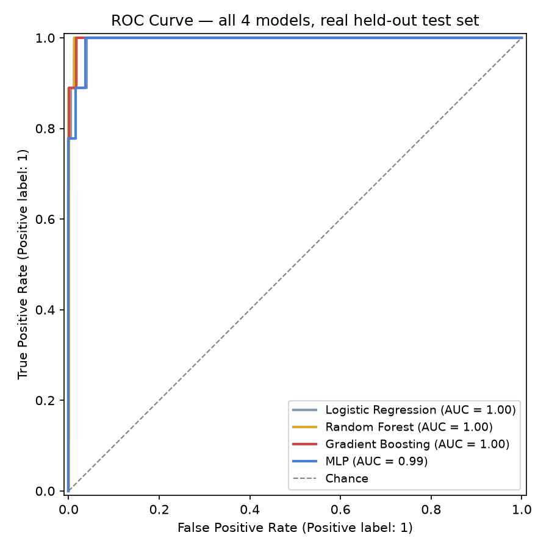
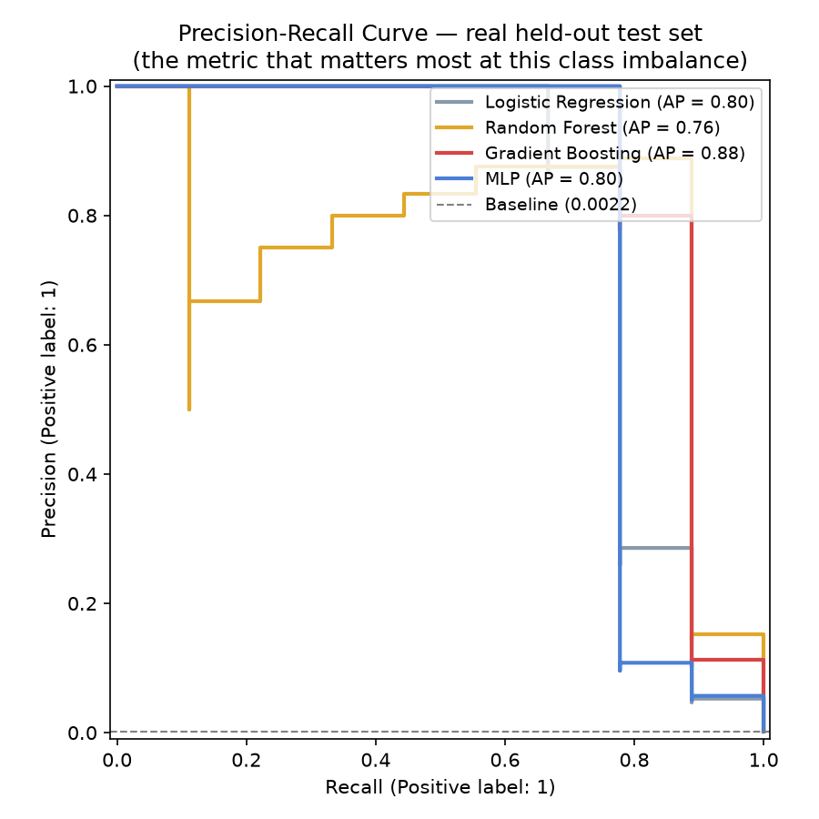
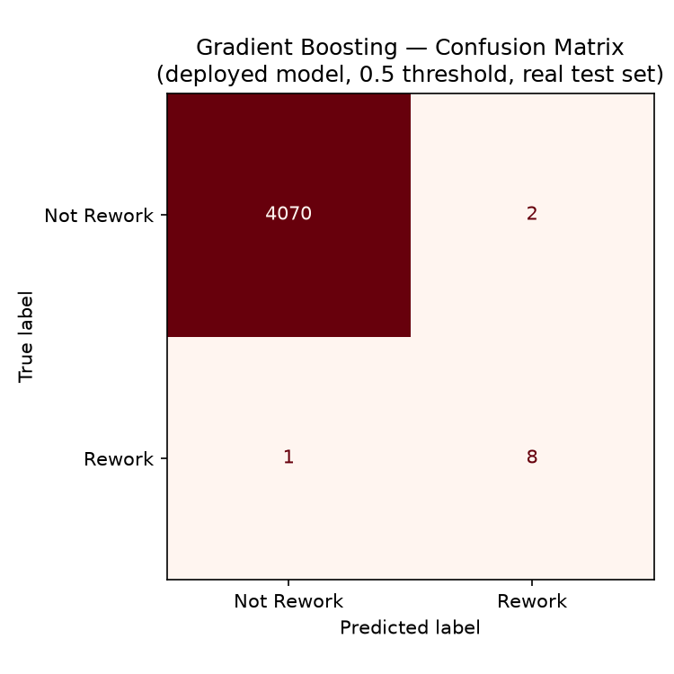
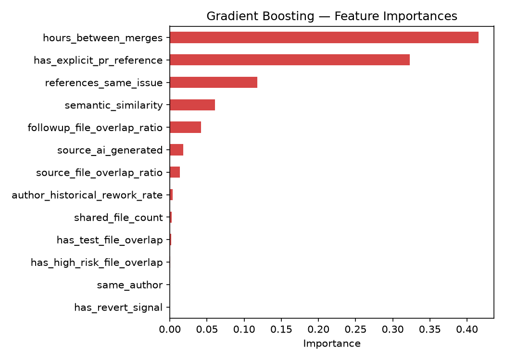

# ML Rework Classifier — Results Report

Generated by `ml-classifier/generate_report.py`. See
`ml-classifier/README.md` for the full write-up (dataset construction,
wiring instructions, limitations) — this doc is the presentation-ready
figures and numbers only.

## Dataset

- 13,952 total candidate pairs (same repo, correct order, within a 90-day window)
- Train: 9,871 pairs (44 genuine rework)
- Test (held out, never seen during training): 4,081 pairs (9 genuine rework)

## Model Comparison

| Model | ROC-AUC | PR-AUC (Average Precision) |
|---|---|---|
| Logistic Regression | 0.9950 | 0.8015 |
| Random Forest | 0.9985 | 0.7602 |
| Gradient Boosting ✅ deployed | 0.9980 | 0.8792 |
| MLP | 0.9941 | 0.7961 |





PR-AUC is the more informative metric here — ROC-AUC looks deceptively
good for all 4 models because the negative class is 99.6% of the data;
PR-AUC is what actually distinguishes how well each model ranks the rare
positive class, which is why it's the deciding metric for choosing
Gradient Boosting.

## Confusion Matrix (Gradient Boosting, deployed model)



- True Positives: 8  ·  False Positives: 2
- False Negatives: 1  ·  True Negatives: 4070
- Precision: 0.800  ·  Recall: 0.889

## Feature Importances (Gradient Boosting)



```
hours_between_merges             0.4158
has_explicit_pr_reference        0.3230
references_same_issue            0.1178
semantic_similarity              0.0606
followup_file_overlap_ratio      0.0421
source_ai_generated              0.0183
source_file_overlap_ratio        0.0136
author_historical_rework_rate    0.0040
shared_file_count                0.0024
has_test_file_overlap            0.0017
has_high_risk_file_overlap       0.0007
has_revert_signal                0.0000
same_author                      0.0000
```
